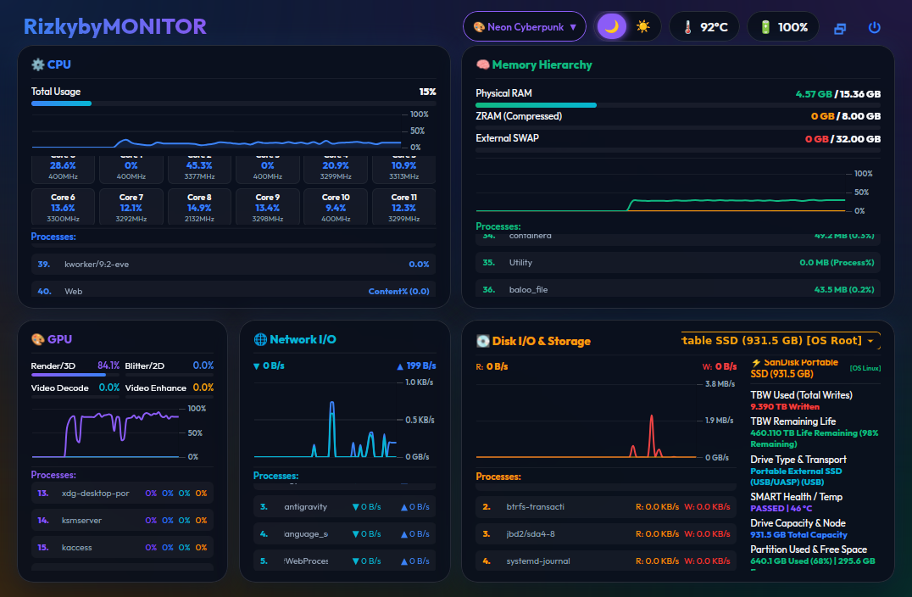
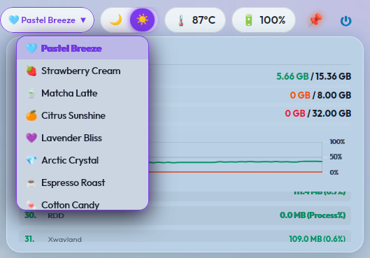
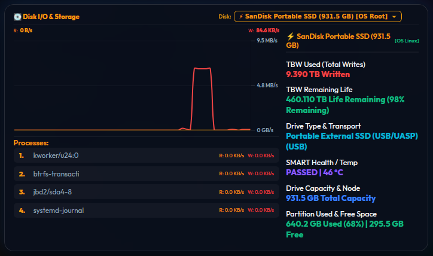
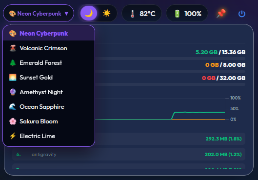
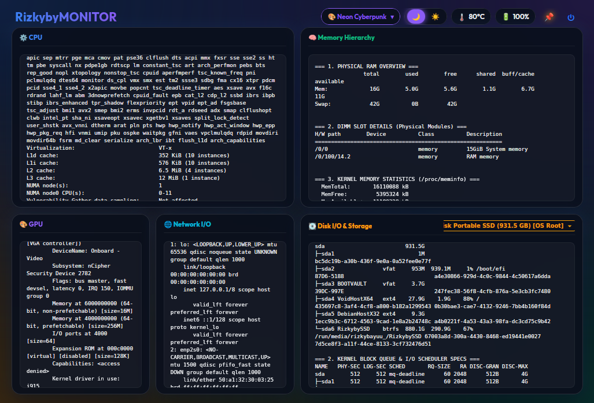
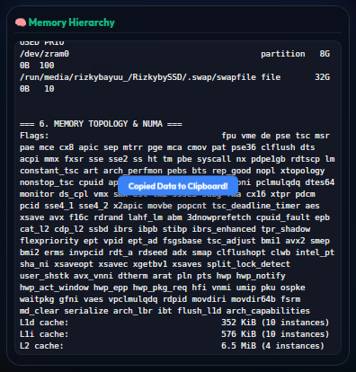

# RizkybyMONITOR ⚡

[](https://github.com/rizkybayuu/RizkybyMONITOR/releases)
[](https://en.cppreference.com/w/cpp/17)
[](https://github.com/rizkybayuu/RizkybyMONITOR)
[](LICENSE)

**RizkybyMONITOR** is an ultra-fast, lightweight, cross-platform native **C++17** hardware monitor and real-time system telemetry suite built with **GTK3 + WebKit2GTK** (Linux) and **Win32 + Microsoft WebView2** (Windows). Designed for power users, it provides high-precision telemetry, frameless multi-window workflows, adaptive per-device memory, and vibrant interactive UI themes without Python, virtual environments, or heavy runtime overhead.

---

## 📸 Screenshots & Showcase

| Main Dashboard & Full Telemetry | Dark / Light Theme & Color Palettes |
| :---: | :---: |
|  |  |
| **Detailed Diagnostic Text Mode** | **Live Process & Network Telemetry** |
|  |  |
| **Multi-Window & Multi-Disk Layout** | **Frameless Desktop Workspace** |
|  |  |

---

## 🌟 Key Highlights

- **⚡ 100% Native C++17 Core**: Sub-10ms startup time, ultra-low resource footprint (< 25 MB RAM), zero Python/pip dependencies.
- **🖼️ True Frameless Multi-Window System**: Completely borderless interface with native window dragging, independent multi-instance duplication, and recursive-safe Always-On-Top pinning (`📌`).
- **🧠 Per-Window State Persistence**: Every window remembers its individual size, screen position, selected disk device, detailed text modes, theme, and font scale in `config.json`.
- **📊 Real-Time Hardware Telemetry**:
  - **CPU**: Per-core percentage usage, dynamic clock frequencies, and core architecture layouts.
  - **GPU**: Intel Iris Xe / GPU clock frequencies and multi-engine utilization (RCS 3D/Render, BCS Blitter, VCS Video, VECS Video Enhancement).
  - **Memory & Swap**: Physical RAM, compressed ZRAM, and persistent NVMe/SSD/HDD Swap partitions.
  - **Multi-Disk Storage**: Real-time read/write I/O throughput, SMART health status (`PASSED`), temperature, TBW (Total Bytes Written), and remaining life percentage for NVMe, SATA, USB SSDs, HDDs, and Flash drives with adaptive fallback.
  - **Network Bandwidth**: Live RX (Download ▼) and TX (Upload ▲) throughput tracking.
  - **Sensors**: Package thermals and live battery charge percentage.
- **🔎 Dynamic Process Inspection**:
  - Top 5 processes for **CPU** (usage %), **Memory** (MB/GB), **GPU** (render engine), **Network** (distinct Left Download ▼ / Right Upload ▲ throughput), and **Disk I/O** (isolated per physical block device).
- **📝 Detailed Text Mode (Right-Click Card Toggle)**: Toggle any widget card between graphical charts and detailed CLI diagnostic logs (`lscpu`, `free -h`, `ip a`, `lsblk`, `smartctl`).
- **🎨 Interactive Color Palettes & Dual Themes**:
  - Dark Mode & Light Mode switchers.
  - 7+ handcrafted color palettes with ambient glow effects, selectable via mouse wheel scroll or direct click dropdown list.
- **📋 Seamless Clipboard Integration**: Middle-click any tooltip or diagnostic card to immediately copy raw metrics or formatted reports into system clipboard (`xclip` / `wl-copy`).

---

## 📐 Dashboard Layout Architecture

```
+-------------------------------------------------------------------------------+
|  RizkybyMONITOR  |  🎨 Neon Cyberpunk ▼  |  🌙 ☀️  |  🌡️ 45°C  🔋 95%  🗗  ⏻  |
+-------------------------------------------------------------------------------+
|  ⚙️ CPU               |  ⚡ GPU (Intel Iris Xe)    |  🧠 RAM / ZRAM / Swap     |
|  - Usage & Frequencies |  - 3D/Render RCS & Clocks  |  - Slot Config & Usage    |
|  - Top 5 CPU Processes |  - Top 5 GPU Processes     |  - Top 5 RAM Processes    |
+-------------------------------------------------------------------------------+
|  🌐 NETWORK           |  💽 DISK I/O (Selected: NVMe / SATA / USB Flash)     |
|  - Bandwidth Charts   |  - Read / Write Rates & Partition Free Capacity       |
|  - Left ▼ / Right ▲   |  - SMART Health, TBW Written & Temperature            |
|  - Top 5 Net Procs    |  - Per-Device Top 5 Disk I/O Processes                |
+-------------------------------------------------------------------------------+
```

---

## ⌨️ Keyboard Shortcuts & Gestures

| Shortcut / Gesture | Action |
| :--- | :--- |
| **Super + Left-Click Drag** *(or Header Drag)* | Move and drag the frameless window freely across screens |
| **Super + Right-Click Drag** *(or Alt + Right-Click)* | Interactively resize the frameless window from anywhere |
| **Left Click on Card** | Toggle **Fullscreen Zoom Mode** for focused inspection |
| **Right Click on Card** | Toggle **Detailed Text Mode** (CLI diagnostic logs) for that card |
| **Middle Click on Card / Tooltip** | Copy telemetry metrics or hardware data to clipboard |
| **Mouse Wheel on Color Selector** | Instantly cycle through vibrant color palettes |
| **Left Click on Color Selector** | Open full floating palette selection menu |
| **Mouse Wheel on Mode Switcher** | Toggle between Dark Mode (`🌙`) and Light Mode (`☀️`) |
| **Ctrl + Mouse Wheel** | Zoom UI in / out (adjust base font scale from 8px to 32px) |
| **Ctrl + N** | Duplicate active window into a new independent instance |
| **Ctrl + Shift + A** | Toggle Always-On-Top (Pin above all other desktop windows) |
| **Alt + Q** | Close the current window and clear its local session memory |
| **Ctrl + Q** *(or Left-Click `⏻`)* | Save all window layouts and safely exit the entire application |
| **Right-Click `⏻`** | Clean exit and reset window layout cache |

---

## 🛠️ Requirements & Dependencies

RizkybyMONITOR supports **Linux** and **Windows** natively with separate source files.

---

### 🐧 Linux Requirements
- **GCC / G++** (C++17 or later)
- **GTK3** (`libgtk-3-dev` / `gtk+3-devel`)
- **WebKit2GTK 4.0 / 4.1** (`libwebkit2gtk-4.1-dev` / `webkit2gtk-4.1-devel`)
- **pthread**

On Debian / Ubuntu:
```bash
sudo apt install build-essential libgtk-3-dev libwebkit2gtk-4.1-dev
```
On Void Linux:
```bash
sudo xbps-install -S base-devel gtk+3-devel webkit2gtk-4.1-devel
```
On Arch Linux:
```bash
sudo pacman -S base-devel gtk3 webkit2gtk-4.1
```

---

### 🪟 Windows Requirements
- **Visual Studio 2019+** or **MSYS2/MinGW-w64** (C++17)
- **Microsoft WebView2** (Edge Chromium built-in WebView2 Runtime — Windows 10 1803+)
  - Install SDK via: `nuget install Microsoft.Web.WebView2` or via `vcpkg install webview2`
- Windows SDK (**10.0.19041.0** or later)
- Linked libraries: `ws2_32`, `iphlpapi`, `pdh`, `psapi`, `powrprof`, `dxgi`, `ole32`, `shlwapi`

---

## 🚀 Building & Running

### 🐧 Linux — Simple Makefile Build
```bash
make
./rizkybymonitor
```
Or via the launcher script:
```bash
./launcher.sh
```

### 🐧 Linux — CMake Build
```bash
mkdir build && cd build
cmake .. -DCMAKE_BUILD_TYPE=Release
cmake --build .
```

### 🪟 Windows — Visual Studio CMake Build
```bat
mkdir build && cd build
cmake .. -DCMAKE_BUILD_TYPE=Release -DWEBVIEW2_DIR="C:\path\to\Microsoft.Web.WebView2"
cmake --build . --config Release
```

### 🪟 Windows — Quick Build Script
A pre-configured build batch file is provided:
```bat
build_windows.bat
```

> **Note**: `rizkybymonitor.exe` and `index.html` must reside in the same directory.
> The `WebView2Loader.dll` (from the WebView2 SDK) must also be present alongside the `.exe`.

---

## 📁 Project Structure

```
RizkybyMONITOR/
├── Makefile                # Linux native Makefile (GTK3 + WebKit2GTK)
├── CMakeLists.txt          # Cross-platform CMake build (Linux + Windows)
├── build_windows.bat       # Windows quick-build script (MSVC)
├── README.md               # Project documentation
├── LICENSE                 # MIT License
├── .gitignore              # Git exclusion rules
├── launcher_linux.sh       # Linux startup & environment wrapper (relative paths)
├── index.html              # Shared dashboard UI (WebKit2GTK / WebView2)
├── assets/
│   └── screenshots/        # Application showcase images
└── src/
    ├── main_linux.cpp      # Linux backend: C++17 daemon, GTK3, sysfs/procfs telemetry
    └── main_windows.cpp    # Windows backend: Win32, WebView2, WinAPI/PDH/Toolhelp32
```

---

## ⚙️ Architecture

RizkybyMONITOR uses the same **shared HTML/JS/CSS frontend** (`index.html`) on both platforms,
served by a native embedded HTTP server. Only the C++ backend differs per OS.

| Component | Linux | Windows |
| :--- | :--- | :--- |
| **Window Manager** | GTK3 (`libgtk-3`) | Win32 API (`CreateWindowExW`) |
| **Web Engine** | WebKit2GTK 4.1 | Microsoft WebView2 (Edge Chromium) |
| **HTTP Server** | POSIX Sockets (`sys/socket.h`) | Winsock2 (`ws2_32.lib`) |
| **CPU Telemetry** | `/proc/stat` | `GetSystemTimes` + `NtQuerySystemInformation` |
| **CPU Frequency** | `/sys/devices/system/cpu/.../cpufreq/` | `CallNtPowerInformation` |
| **RAM / Memory** | `/proc/meminfo` | `GlobalMemoryStatusEx` + `GetPerformanceInfo` |
| **ZRAM / Swap** | `/sys/block/zram0/`, `/proc/swaps` | Windows Pagefile (Virtual Memory Manager) |
| **GPU** | Intel i915 DRM RC6 (`/sys/class/drm/`) | DXGI + PDH GPU Engine counter |
| **Disk I/O** | `/proc/diskstats` + `/sys/block/` | PDH `PhysicalDisk` + `DeviceIoControl` |
| **Disk SMART** | `smartctl` via `/dev/` | `wmic diskdrive` + `DeviceIoControl` |
| **Network** | `/proc/net/dev` | `GetIfTable2` (`iphlpapi`) |
| **Processes** | `/proc/[pid]/io` + `ps` | `Toolhelp32Snapshot` + `GetProcessIoCounters` |
| **Sensors** | `/sys/class/thermal/` + `nmcli` | WMI `MSAcpi_ThermalZoneTemperature` + `GetSystemPowerStatus` |

---

## 📄 License

This project is licensed under the **MIT License** - see the [LICENSE](LICENSE) file for details.

---

## 👤 Author

Developed with ❤️ by **Rizky Bayu** ([@rizkybayuu](https://github.com/rizkybayuu)).
